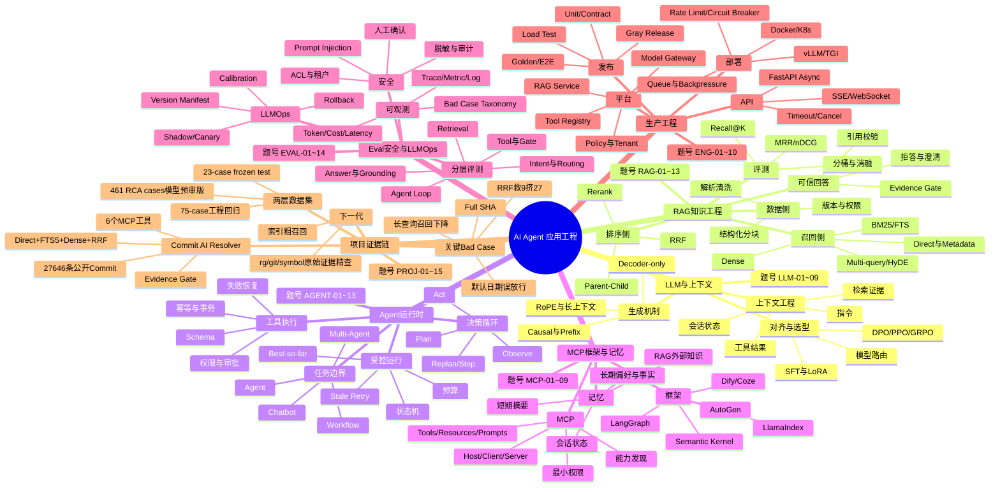
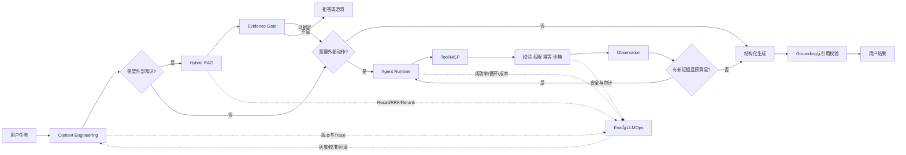

# AI Agent 知识思维导图

目标：先记住“系统链路”，再把专题题号挂到链路上。主干口诀：

> **模型承载上下文 → RAG 找证据 → Agent 做决策 → 工具/MCP 执行动作 → Eval 与安全控风险 → 工程平台保交付。**

## 一张图记住问题之间的因果关系

## 复习节奏

- **第一遍（骨架）：** 每个一级分支只说 30 秒，先回答“解决什么问题”。
- **第二遍（连接）：** 每条虚线或箭头说出一个失败案例，例如“召回有结果但证据不足，所以需要 Gate”。
- **第三遍（证据）：** 把 Commit AI Resolver 的数字和坏例挂到对应节点，不单独背亮点。
- **第四遍（岗位化）：** 根据 JD 只展开 2～3 个分支；其他分支用一句边界说明收住。
