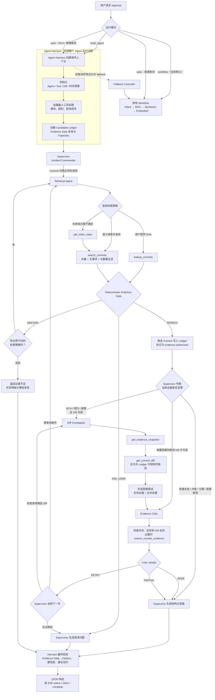

# 07｜项目深挖：Commit AI Resolver（20 题）

> 对外统一口径：当前公开版本是离线可复现 Demo，不描述为已部署 Azure 的线上生产系统；不泄露微软内部客户、账户、路径和数据。

## PROJ-01｜请用 60 秒和 3 分钟介绍 Commit AI Resolver。

**关键词：** **Evidence-first**、**27,646**、**Multi-Agent**、**Harness**、**Evidence Gate**、**Eval**
**关联：** PROJ-07、PROJ-08、PROJ-10、PROJ-13、PROJ-19、PROJ-20

**参考答案：**

**60 秒版：** 这个项目叫 **Commit AI Resolver**，主要解决跨仓库历史变更和回归调查。公开 Demo 对 **27,646 条 React Commit** 建了可重建索引，使用 Direct SHA、Metadata、FTS5、Dense 和 Weighted RRF 生成候选。控制面基于 OpenAI Agents SDK：Incident Commander 根据问题和当前证据，动态决定是否委派 Retrieval、Diff Investigator 和 Evidence Critic。SDK 外还有一层 Harness，强制执行工具权限、Candidate Ledger、多维预算、超时、校验、Trace 和 workflow 回退。真实 gold RCA 已跑通完整三专家路径并命中目标修复 Commit；Critic 因未找到 introducing commit，把结论降为 PARTIAL，而不是让 Supervisor 过度断言。

**3 分钟版：** 我当时想解决的是，线上出现回归以后，怎么从很长的 Commit 历史里快速找到可能相关的变更，而且不能让模型拿一个弱相关结果就编成根因。所以离线侧我先把公开 Commit 做成可审计的 JSON 事实源，再构建 SQLite Metadata、FTS5 和 sqlite-vec 这些可重建索引。在线侧根据查询类型分流：SHA 直接查，repo、日期、作者走结构化过滤，错误码和路径走 FTS5，自然语言症状走 Dense，多路结果再用 RRF 融合。

控制面最初是固定的 Intent → Retrieval → Gate → Synthesis → Evaluation workflow。为了让模型真正决定调查路径，我后来用 OpenAI Agents SDK 的 manager/agents-as-tools 模式，把它重构为 Incident Commander、Retrieval、Diff Investigator 和 Evidence Critic 四类 Agent。Supervisor 只能看到三个 Specialist 工具，根据问题和当前证据决定委派谁；普通查询可以只检索，RCA 可以继续读取 Top-N Diff 并调用独立 Critic。旧 workflow 仍作为 feature-flag baseline 和故障回退。

我没有把所有安全性都交给 SDK。应用侧 Harness 维护 request-local Run State、工具白名单、Candidate Ledger、调用去重、单工具超时，以及 Agent/Tool/Diff/总时长预算。只有检索返回并授权过的候选才能读取 Diff 或进入最终引用；Zod 和代码规则还会验证结构化输出、Commit/URL 和置信度。动态 Commit、Issue、Diff 统一作为不可信数据。Structured Output 会按 provider 能力选择原生 JSON Schema，或 JSON Object + 本地 Zod 二次校验。系统还通过 MCP 暴露 6 个只读工具，并在 JSON/SSE eval 模式输出 bounded trajectory、critic verdict 和 prompt metrics。

评测上我分了两层：一套是 **75-case 工程回归集**，其中 23 条 frozen test 用来防止已知行为退化；另一套是 **461 条 Issue → Closing PR → Fix Commit 的 RCA gold cases**，目前是模型预审版，已经完成全量检索评测，但人工复核前不作为 release gate。针对 Issue-grounded 场景，我只用 Issue 的创建/关闭时间建立 `createdAt - 7d → closedAt + 30d` 窗口，再用本地 LTR 重排四路候选；在 grouped 134-case held-out test 上，Recall@20 从 **70.90% 提高到 94.78%**，Recall@10 为 **92.54%**。这条结果没有使用 LLM reranker，也不能外推到没有 Issue 时间信息的普通文本查询。下一步是对 frozen RCA cases 批量运行 workflow/multi-agent paired eval，重点比较任务成功率、路由正确率、P95、调用量和每成功任务成本。

## PROJ-02｜adocag-server 是 Agent 还是 Pipeline？

**关键词：** **Graph RAG**、**AST**、**Leiden**、**固定流程**、**有界迭代**  
**关联：** RAG-12、AGENT-01

**参考答案：** 我会比较诚实地说，它现在更像一个分层的 **Graph RAG / Deep-research Pipeline**，还不是完全自主的 Agent。AST 分块、实体关系、Leiden 社区、分层检索和 Wiki 生成都有明确阶段；虽然 deep_research 最多能迭代五轮，但它什么时候扩展、什么时候停止，主要还是固定流程控制的。这样讲反而能说明我理解 **Pipeline 和 Agent 的边界**，而不是为了包装什么都叫 Agent。

## PROJ-03｜为什么选择 OpenAI Agents SDK，而不是 LangGraph 或 CrewAI？

**关键词：** **Agents-as-tools**、**模型决策**、**Node ESM**、**Harness 分层**
**关联：** AGENT-10、MCP-08

**参考答案：** 第一版固定 workflow 用普通函数最合适，因为路径短、容易建立 baseline。重构时我的目标是让 Supervisor 通过真实 tool call 决定调用哪个 Specialist，而不是先引入长任务持久化，所以选择了和现有 Node ESM、Zod、OpenAI-compatible endpoint 更贴合的 OpenAI Agents SDK。它的 manager/agents-as-tools 模式正好能把 Retrieval、Diff Investigator 和 Critic 暴露成受控工具。我仍把 Candidate Ledger、权限、预算、超时、校验、Trace 和 fallback 放在自建 Harness 中，避免业务可靠性绑死在 SDK。若以后需要跨进程恢复、人审暂停或复杂状态回放，再评估 LangGraph；如果主要目标是角色协作 demo，CrewAI 更快，但当前项目更看重确定性边界和可测性。

## PROJ-04｜如果重做两个 AI 项目，优先改什么？

**关键词：** **Human Review**、**Open Issue**、**Agent Eval**、**Raw Evidence**、**Observability**
**关联：** PROJ-09、PROJ-12、PROJ-13

**参考答案：** 如果现在重做，我会更早建立 workflow baseline、trajectory schema 和 provider contract test，再开始 multi-agent 重构。当前 Prompt 隔离、Structured Output、四 Agent vertical slice、GitHub Diff、bounded Harness，以及一条真实 Chat API gold RCA 已经跑通；下一步先完成 **461 条 case 的人工四项 Rubric**，冻结 release-gate Gold Dev/Test，并批量比较 workflow 与 multi-agent 的任务成功率、路由、P95、调用量和每成功任务成本。随后补开放 Issue 实验、`rg`/symbol search 源码精查、取消传播和并行调查。只有出现长任务恢复或人审暂停需求时才增加状态图复杂度，不能把单次成功 demo 当成上线证据。

## PROJ-05｜Coding Agent 已能用 `rg + git` 搜索，为什么还需要索引 RAG？

**关键词：** **Current Checkout**、**Cross-repo**、**Reuse**、**Coarse-to-fine**、**Raw Evidence**  
**关联：** RAG-04、PROJ-08、PROJ-15

**参考答案：** 我觉得两者不是替代关系。`rg + git log/show/diff` 很适合 Coding Agent 在已经 Checkout 的当前仓库里精查源码、调用链和原始 Diff，但每次都要重新探索。索引层更适合**跨仓库、长时间跨度和多人重复查询**，因为它能提供低延迟过滤、稳定排序、拒答和离线回归。最合理的组合是：索引先做 Top-N 粗召回，Coding Agent 再打开原始 Diff 和源码验证。

## PROJ-06｜新增 Commit 是否要每天全量重建向量库？

**关键词：** **Event**、**Upsert**、**Content Hash**、**Dual-write**、**Backfill**  
**关联：** RAG-11、PROJ-07

**参考答案：** 不需要每天全量重建。我会按 `repo + commit SHA` 做**幂等 Upsert**，只给新增或者语义文本真的变了的记录重新生成 Embedding。作者、日期、风险和 ACL 这种 Metadata 变化，只更新字段就行。向量缓存键里会放语义文本、模型、维度和模板版本。只有换模型或 Schema 时才建 v2，旧数据低优先级 Backfill，新数据 Dual-write，Eval 通过以后再切换，并保留回滚。

## PROJ-07｜为什么用 JSON 作为事实源、索引作为派生物？

**关键词：** **Source of Truth**、**Manifest**、**Rebuild**、**Compatibility**、**Audit**  
**关联：** RAG-03、EVAL-13、PROJ-06

**参考答案：** 我把 daily JSON 当 **Source of Truth**，因为它保存的是可审计、可以重新处理的 Commit 记录；SQLite Metadata、FTS5 和 sqlite-vec 都只是派生索引，坏了可以重建。Manifest 会固定 corpus hash、条数、模型、维度、Query Instruction、文档模板和索引版本。启动和 Eval 时再检查行数、重复、Missing、Stale 和向量字节长度。发现不一致就拒绝比较，避免新旧向量空间混在一起。

## PROJ-08｜Direct SHA、metadata、FTS5、dense 和多查询如何分工？

**关键词：** **Exact**、**Filter**、**Lexical**、**Semantic**、**Secondary Query**  
**关联：** RAG-04、RAG-09、PROJ-09

**参考答案：** 我是按信号类型分工的：**SHA 直接查**；repo、日期、作者、风险做结构化过滤；错误码、路径和专有名词走 FTS5；自然语言症状走 Dense；Secondary Query 和工单标题补充不同视角。Intent Extractor 只提取用户明确说出的条件。候选范围很窄时先 SQL Pre-filter，再做 Exact Cosine，避免全局 Top-K 后过滤造成漏召回。每个通道的排名都会保留下来，方便融合和消融分析。

## PROJ-09｜为什么用 weighted RRF？评测发现了什么？

**关键词：** **异量纲**、**Rank Contribution**、**Candidate Ceiling**、**时间窗**、**LTR**
**关联：** RAG-05、RAG-13、PROJ-13

**参考答案：** 我选 RRF 是因为 BM25 和 cosine 的分数不是一个量纲，按排名融合比较容易解释。但 Eval 证明 RRF 不是天然有收益：早期等权 RRF 只救回 **9 条 Dense miss**，却挤出 **27 条 Dense Top-10 hit**。我先改成 Dense-primary 权重，把结果修到“救回 6 条、挤出 0 条”，然后继续分析候选上限。第一版 raw/compact 四路 Top-100 pool 在 test 上只覆盖 85.82% gold，所以无论本地 LTR 还是 LLM 都不可能把 Recall@20 做到 90%。最终我利用输入中合法的 Issue 生命周期 metadata 做时间预过滤，把 test candidate availability 提到 97.76%，再用本地 LTR 将 Recall@10/20 提到 **92.54%/94.78%**。这个过程说明：先分清 candidate miss 和 ranking miss，再决定优化召回还是重排，不能只盯一个平均分。

## PROJ-10｜Evidence Gate 为什么放在生成前？如何标定？

**关键词：** **Nearest ≠ Sufficient**、**SEARCH**、**ABSTAIN**、**ASK_USER**、**Calibration**  
**关联：** EVAL-07、PROJ-11

**参考答案：** 向量库对任何问题都能找出最近邻，但**最近不等于证据足够**。所以通用查询链路在生成前有确定性 Evidence Gate，综合 Exact Hit、用户显式过滤、Dense Score、多通道一致性和查询约束，输出 **SEARCH、ABSTAIN 或 ASK_USER**。

RCA 检索升级后，我没有直接沿用旧阈值。时间预过滤会改变 score 和 Top-K 分布，四路候选加 LTR 后也不再只有单一 Dense Score；更危险的是，旧规则把“存在显式 metadata 条件且结果非空”视为强证据，如果把系统推导的 Issue 生命周期窗口伪装成用户显式日期，几乎所有非空结果都可能被放行。因此 Gate v2 先保留查询充分性检查，再区分 `user-explicit`、`issue-lifecycle`、`automatic-default` 和 `retry-expansion` 四种 filter provenance；排序后综合四路命中/排名、Dense-Lexical 共识、LTR top-1 与 top-1/top-2 margin、候选分布和 Diff 原始证据。LTR 的 `predict_proba` 受样本加权影响，不能直接当校准概率；阈值应只在 dev 上用 Platt/Isotonic 或 rank quantile 标定，并用 grouped held-out test 验证。当前 v1 在线运行，v2 已完成设计，待补 hard negative、错配 Issue、OOD、歧义和 candidate/ranking miss 后接入，不能把 23 条旧 frozen test 的 100% 行为准确率直接迁移过来。

## PROJ-11｜23-case frozen test 达到 100%，为什么不能说“可靠性已解决”？

**关键词：** **Small Sample**、**Fixed Corpus**、**Engineering Regression**、**Distribution Shift**  
**关联：** EVAL-14、PROJ-12

**参考答案：** 这个 100% 我会主动解释边界。Frozen Test 只有 **23 条**，语料是固定的，部分正例还是从 Commit 标题派生的，而且最初建集合时也不是严格双盲。所以 Hybrid Recall@10 和 Gate 行为准确率 100%，只能说明**已知工程行为没有退化**，不能代表真实用户措辞、复杂 RCA、跨仓库漂移、LLM 随机性、延迟和成本都解决了。对外我只叫它 **Frozen Engineering Regression Test**，不会叫生产准确率。

## PROJ-12｜如何用公开数据建设可信的 RCA 验证集？

**关键词：** **Issue**、**Closing PR**、**Fix Commit**、**Corpus Hash**、**Human Rubric**  
**关联：** EVAL-03、EVAL-14、PROJ-11

**参考答案：** 我是从 GitHub 的 `Issue.closedByPullRequestsReferences` 关系开始构建，只保留 Closing PR 已合并，而且 Merge/Fix Commit 确实存在于冻结 Corpus 的链路，同时保存 Issue、PR、Commit 的 URL、关系和 Hash。现在有 **461 条 RCA gold cases**，当前为模型预审版；按 shared fix commit 连通组稳定切成 327 dev / 134 held-out test，避免同一修复跨 split。它们已经完成全量 Retrieval Eval，以及 Issue 时间窗 + 本地 LTR 实验。下一步还要人工逐条确认问题是否忠实、修复关系是否成立、Gold 是否完整、Query 是否可用。人工复核完成前，我不会把它当 Release Gate。

## PROJ-13｜如何评测完整 Agent？Harness 实际抓到了什么问题？

**关键词：** **Layered Eval**、**End-to-end**、**Full SHA**、**Explicit Filter**、**Fusion Bad Case**  
**关联：** EVAL-01、EVAL-03、EVAL-05

**参考答案：** 我的 Eval 是两条线：一条分层测索引、Intent、Recall/MRR/nDCG、Gate、引用和循环；另一条让端到端 Runner 多次执行，看任务正确性、路由、幻觉引用、停滞、P95、token 和费用。Harness 先后抓到 Full SHA 查不到、默认日期被误当显式条件、等权 RRF 挤掉 Dense 命中、长查询召回下降、Stale Retry，以及 Top-100 候选池只有 85.82% 的重排上限。真实 provider 联调又暴露出 DeepSeek 不支持 `json_schema`、thinking mode 与 required tool choice 冲突、模型把 null 和数字写成字符串、本地 embedding 服务未启动，以及 GitHub 网页 Diff 超时。修复后改为 provider-aware Structured Output、本地 Zod 校验、参数归一化、固定 GitHub REST API 和可选 token。这个过程体现了 Harness 的价值：不仅测答案，还能定位失败发生在 provider contract、工具、检索、证据还是控制循环。

## PROJ-14｜Multi-Agent 如何避免循环、过度调用和无证据结论？

**关键词：** **多维预算**、**Candidate Ledger**、**去重**、**Critic**、**PARTIAL**
**关联：** AGENT-08、EVAL-04

**参考答案：** 旧 workflow 保留最多 3 轮和 result-set fingerprint；新 multi-agent 再增加独立的 Agent、Tool、Diff、同工具次数、Supervisor turns 和 wall-clock 预算。Harness 缓存参数相同的重复调用，只有 Candidate Ledger 授权过的 Commit 才能读取 Diff 或被引用；有实质新信息时允许再次委派 Retrieval 或 Critic，但仍受总预算和单工具次数限制。Supervisor 不能绕过 Specialist 直接调用底层搜索或 Diff。最终输出还会检查引用、候选 ID 和置信度：因果问题如果没有通过独立 Critic，置信度最多 0.6；Critic 找不到 grounded Diff 或关键反证时只能给 PARTIAL。工具预算耗尽会作为结构化错误返回给模型，让它选择现有证据、澄清或停止；如果整个 multi-agent 运行失败且开启了 fallback，则回到旧 workflow，不允许无限继续。

## PROJ-15｜如何做 grounding、MCP 工具化和下一代架构？

**关键词：** **Citation Validity**、**6 个工具**、**Streamable HTTP**、**Shared Core**、**Agentic Verification**  
**关联：** MCP-01、MCP-03、PROJ-05、PROJ-17

**参考答案：** Grounding 先由程序抽取答案里的 SHA 和引用，再核对冻结 Corpus、Candidate Ledger 和 Required Evidence，统计 **Citation Validity、幻觉引用率和 Coverage**。Diff Investigator 已能通过共享 `commit-diff-service` 读取 ledger 内 Top-N 的 GitHub/ADO 原始 Diff；Critic 再独立检查支持证据、反证和缺口。API、UI、MCP 与 multi-agent 共用检索和 Diff 数据面，MCP 仍通过 Streamable HTTP 暴露 6 个只读工具。下一步不是再造一套检索，而是在同一 Harness 下补 `rg` 和 Symbol Search，并通过 workflow/multi-agent paired eval 证明动态调查带来的质量收益是否值得额外延迟与成本。

## PROJ-16｜新的 Issue 时间窗和本地 LTR 到底如何工作？

**关键词：** **Lifecycle Metadata**、**SQL Pre-filter**、**四路候选池**、**35 Features**、**No LLM**
**关联：** PROJ-08、PROJ-09、EVAL-03、RAG-11

**参考答案：** 这条链路只用于输入本身带 `createdAt/closedAt` 的 Issue。时间窗不是看 gold commit 倒推，而是只在 dev 上比较多个固定窗口，最后选择最小的达标配置：`createdAt - 7 天` 到 `closedAt + 30 天`，它在 dev 上覆盖 98.78% relevant commits。检索时先用 repo 和 commit 日期做 SQL pre-filter，再在窗内分别跑 raw/compact × Dense/Lexical Top 100，合并去重后平均约 153 个候选。

本地 LTR 不生成答案，也不调用 LLM。它读取 35 个可解释 feature，包括四个通道是否命中、排名和相对分、多路共识、word/char TF-IDF，以及 query 对 title、summary、changed files、affected areas 的 overlap。327 dev 内再按 shared fix commit 分成 229 train / 98 validation，比较 Logistic、HistGradientBoosting 和 ExtraTrees，选出 `hist-depth3` 后在全部 dev 重训，最后评估 134 test。结果是 candidate availability 97.76%，Recall@10/20 为 92.54%/94.78%。开放 Issue 没有 `closedAt`，只能暂用 now，并且必须单独评测；普通 text-only 查询也不能引用这组指标。

## PROJ-17｜Commit AI Resolver 暴露了哪 6 个 MCP 工具？它们怎样提供给 IDE Agent？

**关键词：** **1 个 Server / 6 个 Tools**、**Zod Schema**、**Streamable HTTP**、**Session**、**Shared Core**、**Local-only**
**关联：** MCP-02、MCP-04、PROJ-05、PROJ-15

**参考答案：** 准确说，项目不是启动了 6 个 MCP Server，而是一个名为 `commit-ai-resolver` 的 Server 注册了 6 个 Tool：`search_commits` 做 Dense + FTS5 混合检索，`get_commit` 按短 SHA 精确查询，`get_daily_summary` 取单日汇总，`list_available_dates` 列出有数据的日期，`list_commits_by_filter` 按仓库、日期和变更类型枚举 Commit，`get_commit_diff` 获取并过滤真实文件 Diff；此外还有一个 `commit://stats` Resource 返回索引统计。每个 Tool 都用 Zod 声明输入 Schema，结果统一转换成 MCP `content`，错误显式标记 `isError`。

传输层用 Express 的 `/mcp` 端点接 `NodeStreamableHTTPServerTransport`。客户端先发 `initialize`，服务端生成 `Mcp-Session-Id`，并为每个 Session 建立一组 `McpServer + Transport`；之后客户端通过 `tools/list` 发现能力，再用 `tools/call` 调用，GET 和 DELETE 也交给同一 Transport 处理流与会话关闭。Tool Handler 通过依赖注入复用 API 的 Embedding、Vector/FTS 检索、Daily JSON、ADO Diff 和过滤逻辑，并把来源记为 `mcp`，所以不是另写一套业务实现。安装脚本只负责把 `http://127.0.0.1:4399/mcp` 写进 Copilot CLI、Claude 和 VS Code 配置。当前端点无应用级鉴权且 Session 在单进程内存中，因此定位是本机 IDE 集成；若要远程或多实例部署，必须补认证授权、租户隔离和共享或无状态 Session 设计。

## PROJ-18｜为什么 RCA Retrieval 改完以后必须重做 Evidence Gate？

**关键词：** **Distribution Shift**、**Filter Provenance**、**Selective Prediction**、**Hard Negative**、**Causal Evidence**
**关联：** EVAL-02、EVAL-04、RAG-12、PROJ-09、PROJ-10、PROJ-16

**参考答案：** 因为 Retriever 和 Gate 是同一决策系统的上下游，Retriever 一变，Gate 看到的特征分布就变了。旧链路是多路 Dense/Lexical + RRF，Gate 主要看最高 Dense 分、Top-10 通道重叠、结果数和显式 filter；新 RCA 链路先做 Issue 时间窗，再汇总 raw/compact × Dense/Lexical 四路候选，最后由本地 LTR 排序。如果仍用旧 Dense 阈值，会忽略新候选池的共识、LTR margin 和时间窗来源，出现错误放行或过度拒答。

我的改法是把 Gate 拆成三层。第一层在检索前判断 Issue 信息是否足够，缺 repo、时间或关键症状时 ASK_USER；第二层在 LTR 后判断“是否有值得精查的候选”，使用四路共识、rank、相对分、top-1/top-2 margin、窗口宽度和来源，但不把加权训练得到的 LTR score 当天然概率；第三层在读取 `git show/diff`、`rg` 或 symbol 证据后判断“是否足以给出因果结论”，没有原始证据时最多返回候选或 PARTIAL，不能直接生成确定 RCA。标定集必须同时有真实正例、同窗同模块 hard negative、Issue/Commit 错配、OOD、歧义、candidate miss 和 ranking miss；指标同时看 SEARCH recall、ABSTAIN recall、false SEARCH rate、ASK accuracy、coverage 与 selective accuracy。这样 Gate 优化的目标不是单纯提高通过率，而是在可接受覆盖率下控制错误回答成本。

## PROJ-19｜为什么现在可以称为真正的 Multi-Agent，而不是把 Workflow 换了名字？

**关键词：** **模型决定下一步**、**Agents-as-tools**、**差异化轨迹**、**确定性边界**
**关联：** AGENT-01、AGENT-03、AGENT-11、PROJ-03、PROJ-14

**参考答案：** 判断标准是“下一步由谁决定”。现在 Incident Commander 看到的是 `delegate_commit_retrieval`、`delegate_diff_investigation` 和 `delegate_evidence_critique` 三个 Specialist 工具，它会根据用户问题、工具 Observation 和剩余预算决定下一次调用，而不是由 JavaScript 固定顺序调用三个函数。普通变更列表可以检索后直接回答；RCA 可以继续查 Diff、找反证并交给 Critic；证据不足也可以澄清或停止。每个 Specialist 都是独立 SDK Agent，有自己的 prompt、tool allowlist 和结构化输出，所以职责与权限是真隔离。与此同时，Harness 仍用 ledger、预算、超时和校验限制可行动空间。模型拥有路径决策权，不拥有安全边界，这就是我对受控 multi-agent 的定义。

### 当前 Multi-Agent 执行流程

这张图需要强调四点：

1. **动态的是调查路径。** Retrieval 是 Commit 问题的必经证据入口，但之后并不是固定调用三个 Specialist。普通查询可以检索后直接回答；RCA 才可能继续读取 Diff、调用 Critic，Critic 返回 RETRY 后 Supervisor 还可以换查询、检查其他候选、澄清或停止。
2. **确定的是安全边界。** 每次 Tool 或 Agent 调用都经过 Harness。Tool Middleware 检查调用者权限，命中相同参数时直接使用缓存，否则再扣减预算、验证 Candidate Ledger 授权、执行超时控制和输出裁剪，并把动作写入 bounded trajectory。LLM 可以选择工具，但不能修改这些策略。
3. **最终答案仍由代码把关。** `ASK_USER` 会强制转成澄清，`ABSTAIN` 会强制返回证据不足；不存在于授权 Ledger 的 Citation 会被删除；高置信 RCA 没有 Critic PASS 时，置信度最多为 0.6。Multi-Agent 发生非取消异常时可以回退到旧 Workflow，客户端取消则直接终止，避免重复执行。
4. **流式协议与生成流式要区分。** 当前 JSON 和 SSE 接口都已接入 Multi-Agent，但 Supervisor 会先完成结构化输出和最终校验，再把文本分块发送为 SSE `token` 事件；协议兼容现有 UI，目前还不是真正的模型生成过程逐 token streaming。

可以把职责记成一句话：**Supervisor 决定路线，Specialist 生产证据，Harness 掌握规则和刹车。**

**易错点：** 不要把“四个 Agent 类”本身当成证明。要展示真实 trajectory，并说明不同查询会产生不同调用路径。

## PROJ-20｜真实 RCA 跑出了什么结果？如何评价它的质量、成本和边界？

**关键词：** **Gold Commit**、**真实 Diff**、**Critic PARTIAL**、**92.4 秒**、**无回退**
**关联：** PROJ-13、PROJ-14、PROJ-19、EVAL-04、EVAL-08

**参考答案：** 我选了 React issue #33580 对应的 gold RCA。问题描述包含 hydrateRoot、同步 recovery、条件调用 `use(thenable)`，以及后续 “Rendered more hooks” 错误。系统在 27,646 条 Commit 中检索后，Incident Commander 委派 Retrieval、Diff Investigator 和 Evidence Critic；整次运行用了 1 次 Supervisor 加 3 次 Specialist 调用、12 次工具调用和 3 个 GitHub Commit Diff，92.4 秒完成，没有回退到旧 workflow。最终命中 gold fix commit `c3555f0c`，并从 Diff 验证根因：旧逻辑把 `RootSuspendedAtTheShell` 的 incomplete recovery tree 当成成功结果提交，造成 hook list 损坏；修复把这个状态也当成 error。

我认为结果的价值不只是命中 SHA。Critic 识别出 `c3555f0c` 是修复提交，不是已证实的 introducing commit；两轮反证搜索仍没找到引入提交，因此最终给 PARTIAL，置信度 0.55。这说明 grounding 和降级逻辑有效。它的缺点也很明确：92.4 秒对交互查询偏慢，3 个同源 Diff 有重复成本，而且这只是一条 live case，不能代表 461-case 全链路准确率。下一步应做 paired batch eval、同 PR/同 source change 去重、并行 Diff 和 latency/cost 优化。
